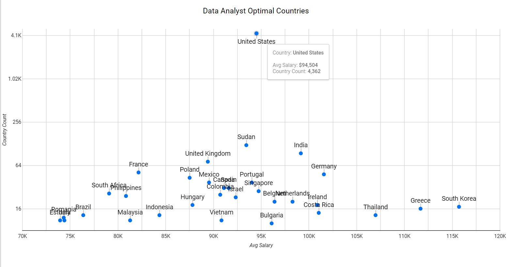

# Overview

For SQL queries click here: [SQL queries](/Analysis/)

For SQl course click here [SQL Course](https://lukebarousse.com/sql)


# Tools I Used

- **PostgreSQL :** For creating the database
- **Visual Studio Code :** Code editor and queries execution
- **GitHub :** Sharing the code & the analysis
- **Looker :** Data vistualiztion

# The Analysis

### 1. Data Jobs Avg. Salary

```sql
SELECT 
    job_title_short AS job_title,
    Round(AVG(salary_year_avg),0) AS avg_salary
FROM 
    job_postings_fact
GROUP BY 
    job_title_short
ORDER BY 
    avg_salary DESC
```


### 2. Data Analyst Postings by Month

```sql
SELECT
    TO_CHAR(job_posted_date, 'Mon') AS month,
    count(job_title_short)
FROM
    job_postings_fact
WHERE
    job_title_short = 'Data Analyst'
    AND date_part('year', job_posted_date) = 2023
GROUP BY
    MONTH
```


### 3. Data Analyst Optimal Countries

```sql
SELECT
    job_country AS country,
    count(*) AS country_count,
    round(AVG(salary_year_avg),0) AS avg_salary
FROM job_postings_fact
WHERE
    job_title_short = 'Data Analyst'
    AND (salary_year_avg, job_country) IS NOT NULL
GROUP BY
    country
HAVING
    count(*) > 9
ORDER BY
    country_count DESC
```





### 4. Data Analyst Optimal Skills

```sql
SELECT
    skills,
    count(*) AS skill_count,
    round(avg(salary_year_avg), 0) AS avg_salary
FROM
    job_postings_fact
INNER JOIN
    skills_job_dim ON job_postings_fact.job_id = skills_job_dim.job_id
INNER JOIN
    skills_dim ON skills_dim.skill_id = skills_job_dim.skill_id
WHERE
    job_title_short = 'Data Analyst'
    AND salary_year_avg IS NOT NULL
    AND job_schedule_type Like '%Full%'
GROUP BY
    skills
HAVING
    count(*) > 99
ORDER BY
    skill_count DESC
```


# Insights
